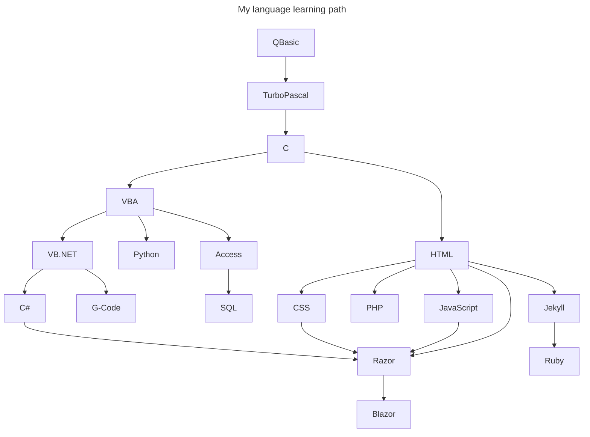

# A digital resume by and for Adam Kauffman

When it came time to make a new resume website I quickly decided I wanted to try out a static website generator. I was faced with a plethora of choices. I chose Jekyll so that I could leverage the automated GitHub workflow that builds and publishes directly to GitHub pages. This allowed me to utilize a continuous integration and deployment pipeline (CI\CD), coupled with the advantage of free hosting.

I procured a `.dev` domain not only to signify that I am a developer but because this top-level domain (TLD) is specifically for development and testing. That's what this little resume site is, a technical test and self-promotion at the same time!

Front end development is not my specialty so I found a good Jekyll resume template to start with. This allowed me to try out this workflow that was new to me without getting bogged down by the design phase.

This was my first foray into not only Jekyll but also Ruby on Rails. I really like the idea of preprocessing and handling as much as you can server side in order to reduce load on the client. Overall, the experience was quite positive! The learning curve was manageable, and I was able to swiftly get my resume online. I even managed to learn a thing or two along the way.

## History in picture

